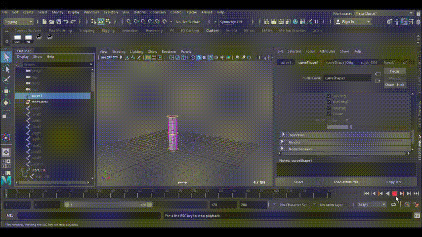

# parallelFrameTransportNode

Maya Node implementing the Parallel Frame Transport algorithm by Hanson and Ma, published in this paper: https://pdfs.semanticscholar.org/7e65/2313c1f8183a0f43acce58ae8d8caf370a6b.pdf

The algorithm transports an initial vector along a curve.
The transported vector is then used to determine consistent rotation values for any point on the curve.

## Features
The node requires a curve and an initial matrix as input and will return rotations as well as translation values for the given param values.

Twisting is limitless and will never flip. It is controlled through a ramp attribute allowing for further use cases.

Additionally the node calculates scale values that can be used for volume preservation. The scales can be controlled through a ramp attribute allowing for further use cases.

## How to use
1. Make **AEparallelFrameTransportTemplate.mel** available in the MAYA_SCRIPT_PATH.
2. Load the plugin.
3. Use the python code from [demo.py](demo.py) to explore the capabilities of this node
